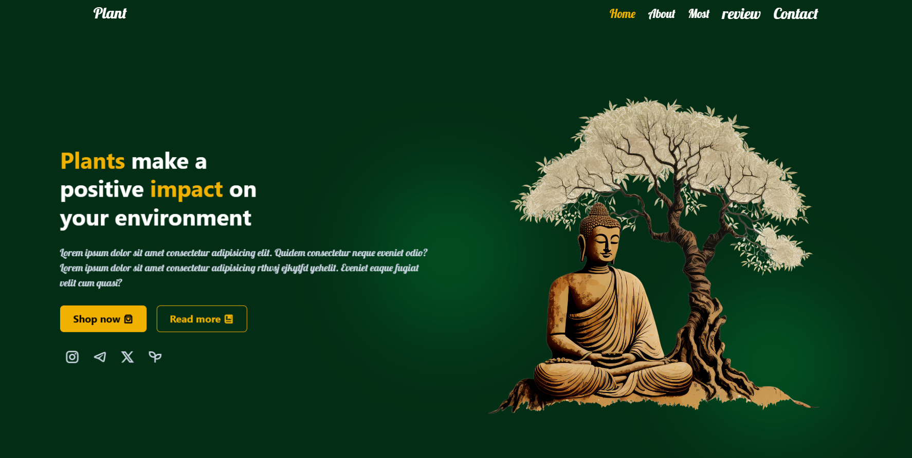

# 🪴 Plant Landing Page | Tailwind CSS + JavaScipt + Swiper.js 

A **modern, responsive, and beautifully animated plant shop landing page** built with **HTML, Tailwind CSS**, and **javaScript, Swiper.js**. Designed with a clean UI/UX approach, fully mobile responsive, and packed with interactive elements for a delightful user experience.

---

## 🔥 Live Demo

[🔗 View Demo](https://MahdiJDS.github.io/plant-landing-page)

---

## ✨ Features

* 🌱 Elegant hero section with animated plant imagery
* 🌀 Swiper.js testimonial carousel with responsive breakpoints
* 🛒 Product cards with rating stars and animated cart buttons
* 🧾 Sticky responsive navbar with smooth scroll & section highlighting
* 📱 Mobile-first navigation menu with hamburger toggle
* 🎯 Scroll-to-top button with smart behavior based on scroll direction
* 🌿 Subtle entrance animations based on scroll view (`animation-timeline: view()`)
* 🧠 SEO-ready structure and well-structured semantic HTML5

---

## 💻 Built With

* **HTML5**
* **Tailwind CSS (via CDN)**
* **Swiper.js** (carousel library)
* **Remix Icons** for sharp icons
* **Google Fonts: Lobster** for unique typography

---

## 📁 Folder Structure

```
plant-landing-page/
├── index.html
├── script.js      
├── imags/             
├── README.md          
```

---

## 📸 UI Preview

  .

---

## ⚙️ How to Use

1. Clone the project:

```bash
git clone https://github.com/MahdiJDS/plant-landing-page.git
```

2. Open `index.html` in your browser (or use Live Server).

3. Customize text, products, or images to fit your brand.

---

## 🧠 Customization Tips

* 🌈 You can change the **brand colors** by editing Tailwind utility classes directly.
* 🖼 Replace PNG plant images in `./imags/` with your own transparent illustrations.
* 🧾 For carousel speed/edit, change Swiper settings inside `<script>`.

---

## 📦 CDN Dependencies

* [Tailwind CSS via CDN](https://tailwindcss.com/docs/installation/play-cdn)
* [Swiper.js](https://swiperjs.com/)
* [Remix Icons](https://remixicon.com/)

---

## 📜 License

This project is licensed under the [MIT License](LICENSE). Free to use and modify for personal or commercial purposes.

---

## 🧑‍💻 Author

I enjoy transforming complex ideas into intuitive user experiences while writing clean, maintainable, and reusable code.

### 🌐 Portfolio

[mahdijds.vercel.app](https://mahdijds.vercel.app/)

### 💻 GitHub

[github.com/MahdiJDS](https://github.com/MahdiJDS)
---


---

> ⚡ If you enjoyed this project, don’t forget to star it and follow for more awesome front-end projects.
